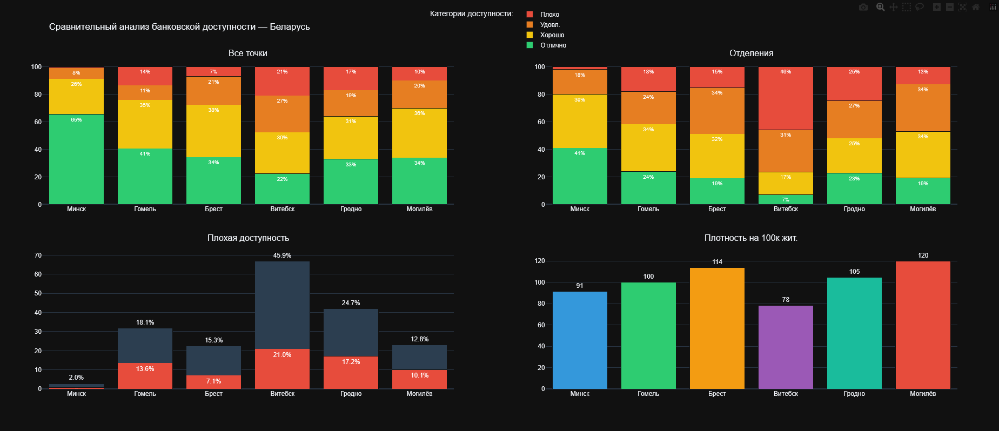
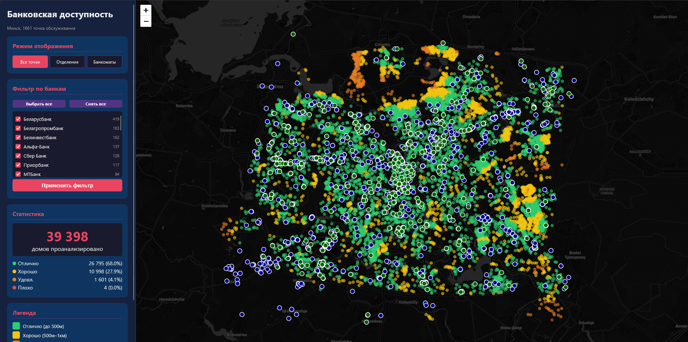

# 🏦 Анализ доступности банковских услуг в Беларуси

[](https://python.org)
[](https://opensource.org/licenses/MIT)

Полный цикл анализа банковской доступности в **6 областных центрах Беларуси**: от сбора данных с Яндекс.Карт до интерактивных дашбордов.



## 📊 Ключевые результаты

| Город    | Домов  | Плохая доступность | Банковских точек |
|----------|--------|--------------------|------------------|
| Минск    | 42 172 |       0.7%         |     1 661        |
| Гомель   | 32 833 |       13.6%        |      491         |
| Брест    | 34 207 |       7.1%         |      381         |
| Витебск  | 66 112 |       21.0%        |      278         |
| Гродно   | 20 812 |       17.2%        |      375         |
| Могилёв  | 36 250 |       10.1%        |      415         |


*Интерактивный дашборд доступности банковских услуг по Минску*

## 🗂️ Структура репозитория

```
├── notebooks/                              # Jupyter ноутбуки
│   ├── belarus_bank_optimized.ipynb        # Сбор данных с Яндекс.Карт
│   ├── belarus_bank_analyzer.ipynb         # Расчёт расстояний и категоризация
│   └── minsk_detailed.ipynb                # Детальный анализ Минска
├── data/                                   # GeoJSON, CSV, JSON с результатами
├── maps/                                   # Folium-карты доступности по городам
├── dashboards/                             # Интерактивные HTML-дашборды
├── images/                                 # Скриншоты и графики
├── .gitignore
├── requirements.txt
└── README.MD
```

## 🛠️ Технологии

| Назначение       | Инструменты                                          |
|------------------|------------------------------------------------------|
| Сбор данных      | Selenium + Яндекс.Карты API                          |
| Геоанализ        | GeoPandas, Shapely, OSMNX                            |
| Визуализация     | Folium, Matplotlib, Plotly                           |
| Дашборды         | HTML/CSS/JavaScript + Leaflet.js                     |

## 🔍 Методология

1. **Сбор данных:** 6 городов × 16–25 квадратов сетки × 2 запроса = 200+ запросов к Яндекс.Картам
2. **Выгрузка домов:** OpenStreetMap через Overpass API
3. **Расчёт расстояний:** от каждого жилого дома до ближайшей банковской точки
4. **Категоризация:**
   - 🟢 Отлично — до 500 м
   - 🟡 Хорошо — 500 м – 1 км
   - 🟠 Удовлетворительно — 1–2 км
   - 🔴 Плохо — более 2 км

## 📁 Результаты

### Интерактивные дашборды (`dashboards/`)
- **`banking_comparison_interactive.html`** — сравнительный дашборд по всем 6 городам
- **`minsk_bank_dashboard_final.html`** — детальный дашборд по Минску

### Карты городов (`maps/`)
Для каждого города сгенерирована Folium-карта зон доступности:
`минск_accessibility_map.html`, `гомель_accessibility_map.html`, `брест_accessibility_map.html`, `витебск_accessibility_map.html`, `гродно_accessibility_map.html`, `могилёв_accessibility_map.html`

## 🚀 Запуск

```bash
git clone https://github.com/yourusername/belarus-banking-accessibility.git
cd belarus-banking-accessibility
pip install -r requirements.txt
jupyter notebook notebooks/belarus_bank_optimized.ipynb
```

Чтобы открыть дашборд в браузере:

```bash
start dashboards/minsk_bank_dashboard_final.html
```

## 📚 Источники данных

- [Яндекс.Карты](https://yandex.by/maps) — поиск банковских точек (банкоматы, отделения)
- [Overpass API](https://overpass-api.de/) — выгрузка жилых домов из OpenStreetMap
